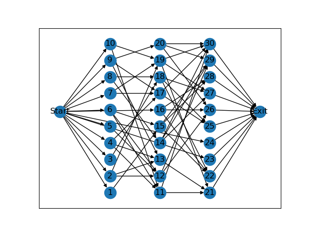

# DAG_Generator

 [Random Directed Acyclic Graph Generator](https://github.com/Livioni/DAG_Generator)

## Installation
It requires the following packages:

- Python 3.9.7
- networkx 2.6.3

## Instructions
生成DAG的代码在DAGs_Generator.py 文件中，其余文件仅供本人毕设参考使用。

##### 简介

工作流通常由DAG（有向无环图）来定义，其中每个计算任务$T_i$由一个顶点(node,task,vertex)表示。同时，任务之间的每个数据或控制依赖性由一条加权的有向边$E_{ij}$表示。每个有向边$E_{ij}$表示$T_i$是$T_j$的父任务，$T_j$只能在其所有父任务完成后执行。为了方便操作和展示，一般在所有任务之前设立一个Start虚拟节点，作为所有没有父任务节点的父节点；同理，在所有任务之后设立一个Exit虚拟节点，作为所有没有子任务节点的子节点，这两个虚拟节点都没有计算资源需求。

此程序用于随机生成有向无环图（DAG）。本来的想法是按照文献[1]的方法来生成DAG，但是原文没有给出代码，难以实现，所以就仿照文章的设定来生成DAG。

确定表示一个DAG需要三个数据，分别是是节点连接信息，各节点的父节点数，各节点的子节点数。由这三个元素可以确定一个独立的DAG。例如一个10个节点的DAG：

**<u>Edges:</u>**     [(1, 5), (1, 6), (2, 4), (2, 6), (3, 6), (4, 7), (4, 9), (5, 9), (5, 7), (6, 7), ('Start', 1), ('Start', 2), ('Start', 3), ('Start', 8), ('Start', 10), (7, 'Exit'), (8, 'Exit'), (9, 'Exit'), (10, 'Exit')] 

**<u>In_degree:</u>** [1, 1, 1, 1, 1, 3, 3, 1, 2, 1]  #不包括虚拟节点

**<u>out_degree:</u>**  [2, 2, 1, 2, 2, 1, 1, 1, 1, 1]  #不包括虚拟节点


##### 参数设定

```python
set_dag_size = [20,30,40,50,60,70,80,90]             #random number of DAG  nodes       
set_max_out = [1,2,3,4,5]                            #max out_degree of one node
set_alpha = [0.5,1.0,1.5]                            #DAG shape
set_beta = [0.0,0.5,1.0,2.0]                         #DAG regularity
```

1. set_dag_size : 设定的DAG任务大小，有[20,30,40,50,60,70,80,90]，默认为20。
2. set_max_out: 设定的一个节点最大出度，有[1,2,3,4,5]，默认为2。
3. set_alpha : 设定DAG控制形状的参数，有[0.5,1.0,1.5]，默认为1.0。
4. set_beta ：设定DAG每层宽度的规则度参数，有[0.0,0.5,1.0,2.0] ，默认为1.0。

DAG的层数（深度）被设置为$\sqrt{set\_dag\_size}/set\_alpha$, $\alpha$控制着DAG的Fat，$\alpha$越小，DAG越瘦长，$\alpha$越大，DAG越肥密。


每层的宽度被随机设置为均值为$set\_dag\_size/length$，标准差为$\beta$的正态分布。$\beta$越大，DAG越不规则。

##### 绘制

使用networkx库绘制DAG图。

```python
def plot_DAG(edges,postion):
    g1 = nx.DiGraph()
    g1.add_edges_from(edges)
    nx.draw_networkx(g1, arrows=True, pos=postion)
    plt.savefig("DAG.png", format="PNG")
    return plt.clf
```

n = 30,max_out = 3, $\alpha$ = 1, $\beta$ = 1.0


n = 30,max_out = 3, $\alpha$ = 0.5, $\beta$ = 1.0


n = 30,max_out = 3, $\alpha$ = 1.5, $\beta$ = 1.0



##### 代码

```python
import random,math,argparse
import numpy as np
from numpy.random.mtrand import sample
from matplotlib import pyplot as plt
import networkx as nx

parser = argparse.ArgumentParser()
parser.add_argument('--mode', default='default', type=str)#parameters setting
parser.add_argument('--n', default=10, type=int)          #number of DAG  nodes
parser.add_argument('--max_out', default=2, type=float)   #max out_degree of one node
parser.add_argument('--alpha',default=1,type=float)       #shape 
parser.add_argument('--beta',default=1.0,type=float)      #regularity
args = parser.parse_args()

set_dag_size = [20,30,40,50,60,70,80,90]             #random number of DAG  nodes       
set_max_out = [1,2,3,4,5]                              #max out_degree of one node
set_alpha = [0.5,1.0,2.0]                            #DAG shape
set_beta = [0.0,0.5,1.0,2.0]                         #DAG regularity

def DAGs_generate(mode = 'default',n = 10,max_out = 2,alpha = 1,beta = 1.0):
    ##############################################initialize###########################################
    args.mode = mode
    if args.mode != 'default':
        args.n = random.sample(set_dag_size,1)[0]
        args.max_out = random.sample(set_max_out,1)[0]
        args.alpha = random.sample(set_alpha,1)[0]
        args.beta = random.sample(set_alpha,1)[0]
    else: 
        args.n = n
        args.max_out = max_out
        args.alpha = alpha
        args.beta = beta

    length = math.floor(math.sqrt(args.n)/args.alpha)
    mean_value = args.n/length
    random_num = np.random.normal(loc = mean_value, scale = args.beta,  size = (length,1))    
    ###############################################division############################################
    position = {'Start':(0,4),'Exit':(10,4)}
    generate_num = 0
    dag_num = 1
    dag_list = [] 
    for i in range(len(random_num)):
        dag_list.append([]) 
        for j in range(math.ceil(random_num[i])):
            dag_list[i].append(j)
        generate_num += math.ceil(random_num[i])

    if generate_num != args.n:
        if generate_num<args.n:
            for i in range(args.n-generate_num):
                index = random.randrange(0,length,1)
                dag_list[index].append(len(dag_list[index]))
        if generate_num>args.n:
            i = 0
            while i < generate_num-args.n:
                index = random.randrange(0,length,1)
                if len(dag_list[index])==1:
                    i = i-1 if i!=0 else 0
                else:
                    del dag_list[index][-1]
                i += 1

    dag_list_update = []
    pos = 1
    max_pos = 0
    for i in range(length):
        dag_list_update.append(list(range(dag_num,dag_num+len(dag_list[i]))))
        dag_num += len(dag_list_update[i])
        pos = 1
        for j in dag_list_update[i]:
            position[j] = (3*(i+1),pos)
            pos += 5
        max_pos = pos if pos > max_pos else max_pos
        position['Start']=(0,max_pos/2)
        position['Exit']=(3*(length+1),max_pos/2)

    ############################################link###################################################
    into_degree = [0]*args.n            
    out_degree = [0]*args.n             
    edges = []                          
    pred = 0

    for i in range(length-1):
        sample_list = list(range(len(dag_list_update[i+1])))
        for j in range(len(dag_list_update[i])):
            od = random.randrange(1,args.max_out+1,1)
            od = len(dag_list_update[i+1]) if len(dag_list_update[i+1])<od else od
            bridge = random.sample(sample_list,od)
            for k in bridge:
                edges.append((dag_list_update[i][j],dag_list_update[i+1][k]))
                into_degree[pred+len(dag_list_update[i])+k]+=1
                out_degree[pred+j]+=1 
        pred += len(dag_list_update[i])


    ######################################create start node and exit node################################
    for node,id in enumerate(into_degree):#给所有没有入边的节点添加入口节点作父亲
        if id ==0:
            edges.append(('Start',node+1))
            into_degree[node]+=1

    for node,od in enumerate(out_degree):#给所有没有出边的节点添加出口节点作儿子
        if od ==0:
            edges.append((node+1,'Exit'))
            out_degree[node]+=1

    #############################################plot##################################################
    return edges,into_degree,out_degree,position
```

## 参考

<div id="refer-anchor-1"></div>
[1] [List Scheduling Algorithm for Heterogeneous Systems by an Optimistic Cost Table](https://ieeexplore.ieee.org/abstract/document/6471969/)

[2] [Building DAGs / Directed Acyclic Graphs with Python](https://mungingdata.com/python/dag-directed-acyclic-graph-networkx/)

[3] [DAG Dependencies](https://ipython.org/ipython-doc/3/parallel/dag_dependencies.html)

[4] [Networkx Lirbrary](https://networkx.org/)

[5] [Python生成依赖性应用的DAG(有向无环图)拓扑](https://blog.csdn.net/qq_26606467/article/details/108929048?ops_request_misc=%257B%2522request%255Fid%2522%253A%2522164005746516780357255563%2522%252C%2522scm%2522%253A%252220140713.130102334.pc%255Fall.%2522%257D&request_id=164005746516780357255563&biz_id=0&utm_medium=distribute.pc_search_result.none-task-blog-2~all~first_rank_ecpm_v1~rank_v31_ecpm-3-108929048.pc_search_insert_es_download&utm_term=dag+%E7%94%9F%E6%88%90+python&spm=1018.2226.3001.4187)

